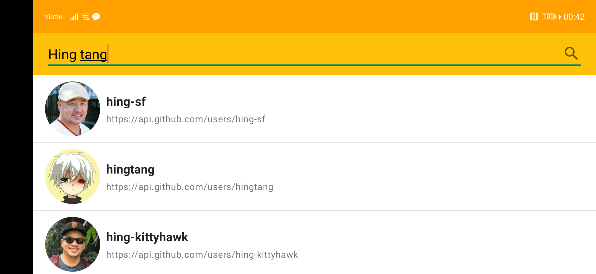
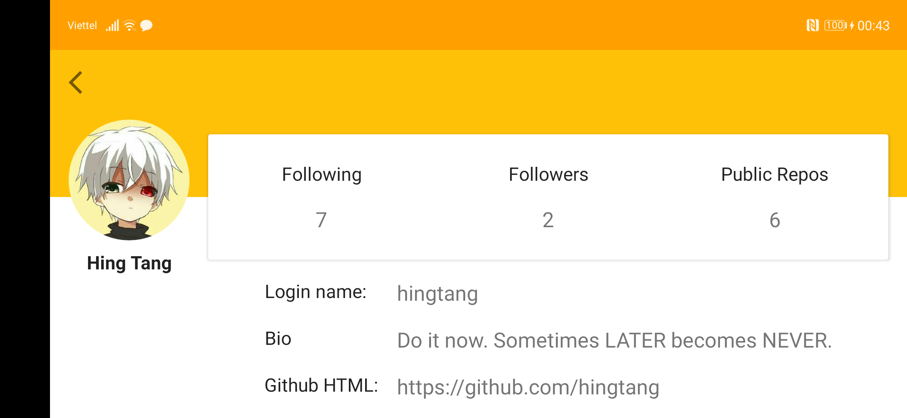

# Github Users
- Display Github Users, support the searching and paging.
- Display the Github User detail, support land layout

# Android Architecture Component
- Architecture: Clean Architecture, MVVM
- Retrofit : to retrieve the data from server
- Coroutines Flow : to subscribe the API calls with State
- Hilt : Dependency Injection Framework
- LiveData : to observe the data
- And some UnitTest libs like Mockk, core-testing, kotest, ...

# Screenshots

